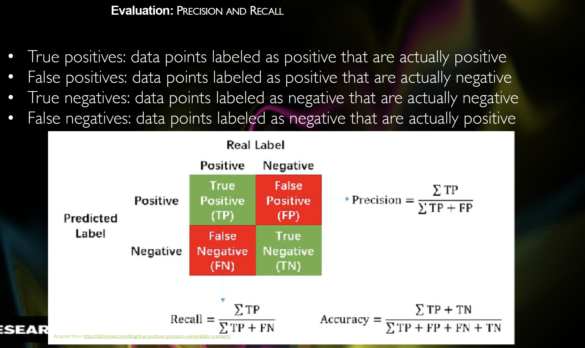

## Week2-Lecture 3 Learning to Classify Text

### Learning outcomes
- What is Supervised Classification?
- Different examples of text classification tasks?
- Sentence Segmentation
- Identifying Dialog Act Types
- Recognizing Textual Entailment (RTE) ...
- How to evaluate a classifier?
- Examples of supervised classification algorithms
    - Decision Trees
    - Naive Bayes Classifier
    - Maximum Entropy Classifiers

####  What is Supervised Classification?
Supervised classification is a task where the correct class label is chosen for a given input based on a set of labels defined in advance. ​ It involves using a classifier and training data to make decisions. ​ In supervised classification, examples include deciding whether an email is spam or not, determining the topic of a news article from a fixed list of topics, and identifying different meanings of a word based on context. ​

#### Types of Text Classification Tasks

1. Sentence Segmentation: This task involves classifying text based on punctuation to determine where sentences end. ​ It requires deciding whether symbols like periods or question marks terminate the preceding sentence. ​ Features are extracted from text data to aid in sentence segmentation. ​

2. Identifying Dialog Act Types: This task focuses on understanding the type of action performed by a speaker in a conversation. ​ Examples of dialog act types include greetings, questions, answers, assertions, and clarifications. ​ Data from sources like the NPS Chat Corpus can be used to build classifiers that identify dialogue act types in new instant messaging posts. ​

3. Recognizing Textual Entailment (RTE): In this task, the goal is to determine if a given piece of text entails another text known as the hypothesis. ​ It involves finding evidence to support the hypothesis by analyzing the text. ​ For example, determining if a text provides enough evidence to accept a hypothesis like 'Sandra Goudie was defeated by Max Purnell' based on the information provided in the text. ​

#### Measuring accuracy of Text Classification Tasks

- Accuracy:
    - Definition: It tells us how often the classifier is correct.
    Formula: (Correct Predictions) / (Total Predictions).
    - Example: If you have 1000 documents, and 990 are not related to sports while 10 are related to sports, the accuracy of a classifier that labels every document as irrelevant would be high but misleading. so high accuracy may not indicate good performance in unbalanced datasets.

- Precision:
    - Definition: It measures how many of the items labeled as positive are actually positive. ​
    - Formula:  True Positives / (True Positives + False Positives).
    - Example: It focuses on the true positives and false positives in the classification results. ​

- Recall:
    - Definition: It measures how many of the actual positive items were identified correctly.
    - Example: It considers true positives and false negatives in the classification results. ​
    Formula:  True Positive / True Positive + False Negatives

- Confusion Matrix:
    - Definition: It summarizes the results of the classifier's predictions.
    - Example: It helps visualize the classifier's performance by showing true positives, false positives, true negatives, and false negatives.

- Cross Validation:
    - Definition: It involves dividing the data into folds for multiple evaluations.
    - Example: It ensures that the model is tested on different subsets of data to get a more robust evaluation.

Remember, accuracy gives an overall view, precision focuses on the positive predictions, recall looks at actual positives, confusion matrix summarizes results, and cross-validation ensures thorough testing.

####  Algorithms for Supervised Classification
1. Decision Trees:  Decision trees,  are  flowcharts that help in making decisions by following a series of questions based on the input features. 

-   Structure:
    In decision trees each node represents a question about a feature of the input data.
    The first node at the top is the root node, which asks the initial question based on a feature. 
    The branches from each node represent the possible answers to the question, leading to more nodes or leaf nodes.

- Decision Making:

At each node, a decision is made based on the value of a specific feature. ​
The decision leads to moving down the tree to the next node until a leaf node is reached.
The leaf node provides the final decision or classification based on the path followed through the tree. ​

Example:

Suppose you want to classify fruits as either apples or oranges based on color and size.
The root node may ask: "Is the fruit red?"
If yes, it may lead to a leaf node classifying it as an apple. If no, it may ask another question like "Is the fruit round?"
Following the path of questions leads to the final classification of the fruit.

Simplicity:

Decision trees are easy to interpret and visualize, making them useful for understanding how decisions are made.
They break down complex decision-making processes into simple, understandable steps.

Advantages:

Decision trees can handle both numerical and categorical data. ​
They require little data preparation and can handle missing values.
They are versatile and can be used for classification and regression tasks.

Below is a **detailed flowchart for Naive Bayes Classifier** along with a step-by-step breakdown to help you understand the math and logic behind it.

---

#### **Naive Bayes Classifier**

The Naive Bayes Classifier is a probabilistic model that calculates the likelihood of each label for a given input by combining prior probabilities with the contributions from each feature. ​ 

It starts by calculating the prior probability of each label based on the frequency of labels in the training set. ​ 

Then, it combines the contribution of each feature with the prior probability to estimate the likelihood of each label for the input. ​ 

Finally, it assigns the label with the highest likelihood to the input. ​ 

This approach is based on the underlying probabilistic model P(label ​|features), where the goal is to find the most likely label given the input features. ​ The classifier calculates this probability by multiplying the prior probability of the label with the likelihood of the features given that label. ​ This method allows the Naive Bayes Classifier to efficiently classify data, especially in text classification tasks, by considering the probability of each label based on the input features. ​

##### **Example Workflow for Naive Bayes in Text Classification**
1. **Input document**: "The football match was intense."
2. **Training data labels**: "Sports", "Politics", "Technology".
3. **Prior probabilities**:  
   - \( P(sports) = 0.7 \)  
   - \( P(politics) = 0.2 \)  
   - \( P(technology) = 0.1 \)
4. **Conditional probabilities**:  
   - \( P(\text{“football”} | sports) = 0.6 \)  
   - \( P(\text{“match”} | sports) = 0.5 \)
5. **Posterior Calculation**:  
   - \( P(sports | features) = 0.7 \times 0.6 \times 0.5 = 0.21 \)
6. **Predicted Label**: "Sports".

---

**Strengths of Naive Bayes**
- **Simple and fast** to train.
- Works well with **small datasets**.
- Particularly effective for **text classification** (spam detection, sentiment analysis).

**Limitations**
- Assumes **independence** between features, which may not always hold.
- If a feature’s probability is **zero**, the entire product becomes zero (can be mitigated using **Laplace smoothing**).

##### **1. Bayes' Theorem**  
The Naive Bayes classifier applies **Bayes’ theorem** to calculate the posterior probability of a class given the features.  
$
P(label | features) = \frac{P(label) \times P(features | label)}{P(features)}
$
- $ P(label | features)$: Posterior probability of the label given the features.  
- $ P(label)$: Prior probability of the label.  
- $ P(features | label)$: Likelihood of the features given the label.  
- $ P(features)$: Evidence (same across all labels, so it can be ignored for comparisons).

##### **Example Calculation**  
Let’s say we classify a document with two words: **“football”** and **“match”**, with possible labels being **“Sports”** and **“Politics”**.

###### Given:  
- $ P(Sports) = 0.7 $, $ P(Politics) = 0.3 $  
- $ P(\text{football} | Sports) = 0.6 $, $ P(\text{football} | Politics) = 0.1 $  
- $ P(\text{match} | Sports) = 0.5 $, $ P(\text{match} | Politics) = 0.2 $  

###### Step 1: Calculate Posterior for Sports  

$
P(Sports | features) \propto 0.7 \times 0.6 \times 0.5 = 0.21
$

###### Step 2: Calculate Posterior for Politics 

$
P(Politics | features) \propto 0.3 \times 0.1 \times 0.2 = 0.006
$

###### Step 3: Choose the Label  

Since $ 0.21 > 0.006 $, the classifier predicts **“Sports”**.

---

Here’s a tabular comparison between **Naive Bayes** and **Maximum Entropy (MaxEnt)** classifiers to highlight their key differences:

| **Aspect**                             | **Naive Bayes Classifier**                                         | **Maximum Entropy (MaxEnt) Classifier**                      |
|---------------------------------------|--------------------------------------------------------------------|-------------------------------------------------------------|
| **Approach**                          | Probabilistic, based on Bayes’ theorem.                            | Logistic regression-based, optimizing entropy.               |
| **Feature Assumption**                | Assumes features are **conditionally independent** given the label.| **No independence assumption**; allows feature correlations. |
 **Handling Zero Probabilities**       | Requires **Laplace smoothing** to prevent zero probabilities.      | No need for smoothing; zero probabilities handled by weights.|
| **Training Complexity**               | **Faster training**, simpler calculations.                         | **Slower training**, involves optimization to maximize entropy.|
| **Handling of Feature Interactions**  | Cannot model interactions between features.                        | **Can model feature interactions** through parameter weights.|
| **Interpretability**                  | Probabilities have a direct meaning (prior and conditional).       | Weights indicate feature importance but not direct probabilities.|
| **Suitability for Small Datasets**    | Works well with **small datasets** due to its simplicity.          | Requires **larger datasets** for better generalization.      |
| **Use Cases**                         | Text classification, spam detection, sentiment analysis.           | Natural language processing, information retrieval, text categorization. |
| **Strengths**                         | **Simple, efficient**, good for high-dimensional data.             | **Flexible, no independence assumption**, supports rich feature sets.|
| **Limitations**                       | Performance degrades with **strongly correlated features**.        | **Overfitting** risk if too many features or insufficient data.|

---

The table highlights how Naive Bayes and Maximum Entropy classifiers differ in terms of assumptions, training complexity, interpretability, and use cases. Let me know if you need more details on any specific aspect!

#### Model Types
The slide on modeling linguistic patterns discusses the difference between descriptive and explanatory models in the context of natural language processing. ​

Descriptive models are mentioned as capturing patterns in the data without providing information on why those patterns exist. ​ They focus on identifying correlations within the data. 

On the other hand, explanatory models aim to understand the properties and relationships that cause linguistic patterns to occur. ​ These models go beyond just identifying patterns and seek to explain the underlying reasons behind those patterns.

Most models generated automatically from a corpus are descriptive in nature, as they primarily focus on identifying patterns and correlations within the data. ​

Explanatory models, while more insightful, are often more complex to construct and may require a deeper understanding of the underlying mechanisms driving the linguistic patterns.