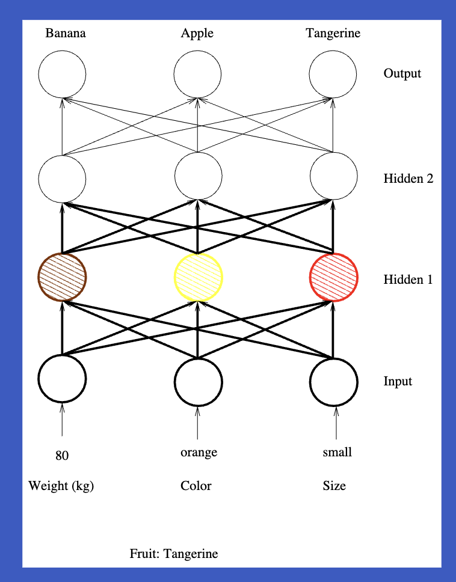

### Multilayer Feedforward Neural Network

- Made of a set of neurons logically arranged into 2 or more layers Input and output layers One or more hidden layers between input and
output layers
- Information flows in one direction only
- Allow for intra-layer connections
- Full and partial connectivity

<!-- images here  -->

This diagram illustrates the structure and operation of a Feedforward Neural Network (FFNN), also known as a multilayer perceptron. Let's break it down layer by layer:

Input Layer:

Located at the bottom of the diagram.
Consists of three nodes, representing the input features of the data.
These nodes receive the initial information that will be processed by the network.

Hidden Layers:

The diagram shows two hidden layers, labeled "Hidden 1" and "Hidden 2".
Each hidden layer has three nodes.
These layers process the information from the previous layer and pass it to the next.

Output Layer:

At the top of the diagram, consisting of three nodes.
This layer produces the final output of the network.

Connections (Weights):

Represented by the lines connecting nodes between layers.
Each connection has an associated weight that determines its strength or importance.
These weights are adjusted during the learning process.

Information Flow:

Indicated by upward arrows on the left side of the diagram.
Information moves from the input layer, through the hidden layers, to the output layer.
This unidirectional flow is what defines it as a "feedforward" network.

Weight Update:

Shown by downward arrows on the right side of the diagram.
During training, the network adjusts its weights based on the error between predicted and actual outputs.
This process, known as backpropagation, moves from the output layer back to the input layer.

#### Connectivity Level
Fully Connected Output

Partially Connected Output

#### Activation Functions
- Linear and non-linear functions that determine the output of a neuron
- ReLu
- Sigmoid
- Tanh

#### Output Layer
- One output unit per class or single unit for
function approximation.
- Weights are updated by using an error correction
rule
- Error signal for output units is equal to difference
between predicted and observed values
- Weight values are updated in proportion to the
error time the input signal
- This diminishes the error in the direction of the
gradient (the direction of most rapid change in the
error).

#### Hidden Layer
- Made of hidden units (i.e. units which are neither input not output)
- We do not know what the hidden units are
supposed to produce as output
- Therefore, we cannot directly compute the error
signal for hidden units
- So, how do we update hidden unit weights??
- Based of error at the output Hidden units must be told how large the error is and how strongly the internal units are connected
to the output units in error
- Weights have to be run backwards (back
propagation) so that the hidden unit knows:
- How strongly it is connected to an output unit
 The error at that unit
- Hidden unit sums up all its weighted error
contributions
- It can modify its weight values according to the
product of input and summed of weighted errors
from higher layers going backward.

#### Training NN
- Optimisation of a very non linear system made of
a large number of highly correlated variables.
- Abundance of false minima
- Procedure:
- Init all weights to small non zero values
(random gen)
- Present a subset of training samples to NN
one at the time.
- One pass through this cycle [present a subset of
TS, measure error, update weights] is called an
epoch
- Often entire data set used for epoch
- Error measurement −→ mean square error
- $ E_p = \frac{1}{n} \sum_{j=0}^{n-1} (t_{pj} - O_{pj})^2 $
- $t_{pj}$ = training pattern p, activation output j.
- We need the derivative of error with respect to
each weight to know the way weights must move
to reduce error
- Derivative of output layer weight connecting layer neuron i to output neuron j

$
\frac{\partial E}{\partial w_{ij}} = -o_i \cdot f'(net_j) \cdot (t_j - O_j)
$

- $o_i$ = output of previous layer neuron i
- $net_j$ = weighted sum coming into output layer
neuron j
- $O_j$ = neurons obtained activation
- $Ij$ = desired output activation for that neuron

#### Update of Hidden-Layer Weights

- $\delta_j = f'(net_j) \cdot \sum_k (\delta_k \cdot w_{kj})$
- $\frac{\partial E}{\partial w_{ij}} = -o_i \cdot \delta_j$
- $w_{kj}$ = weight connecting neuron $j$ in this hidden layer to neuron $k$ in the next layer

- $\delta_k$ = deltas for layer following hidden layer
- $\delta_j$ = deltas being computed for hidden layer
- Compute partial derivative of the error with respect to $w_{ij}$ (weight connecting this hidden layer neuron $j$ with previous layer neuron $i$)

- Evaluation of derivatives occurs in opposite order as executing NN
    - Output layer done first
    - Its $\delta$'s are used to compute derivatives for the next layer back
    - Backpropagation of output errors

#### Training NN
- Backpropagation of errors
- 1st practical method for training multilayer feed
forward NN
- Conjugate gradient
- Generally faster and more robust

#### BP of Error
Output layer errors are successively propagated
backwards through the network
- Gradient descent algorithm
- Gradient of a multilayer function
- Direction that is most steeply “uphill”
- Tiny step in that direction produces max
increase of function compared to all other
possible directions
- Tiny step in opposite direction produces max
possible decrease of function

- Our function −→ Network’s error for the training
set
- Therefore we compute gradient of this error
function
- Take a step in opposite direction (direction of
negative gradient)
- Repeat as needed
- By always stepping in the optimal direction to
reduce error (locally) we expect to descend to the
min error location quickly

- Exact distance to step (learning rate) can be
critical
- Distance too small -> convergence too slow
- Distance too large -> jump up and down and
never converge
- Gradient is extremely local pointer to optimal
function change. Time consuming to find min error
- Difficult to know in advance size of step in
negative gradient direction

---
 **Backpropagation step-by-step**, that solves the **OR logic gate problem**. We’ll carefully define the **weights, biases**. 

### **1. Problem Setup: OR Logic Gate**  
The **OR gate** returns:
- **1** if **at least one input** is 1.
- **0** only if **both inputs** are 0.

| **Input 1 (x₁)** | **Input 2 (x₂)** | **OR Output (y)** |
|------------------|------------------|-------------------|
| 0                | 0                | 0                 |
| 0                | 1                | 1                 |
| 1                | 0                | 1                 |
| 1                | 1                | 1                 |

We want a neural network with:
- **2 input neurons** (for \(x_1\) and \(x_2\))  
- **2 neurons in the hidden layer** (with sigmoid activations)  
- **1 output neuron** (with sigmoid activation)  

---

### **2. Initial Weights and Biases**

We initialize the **weights and biases randomly**. Let’s pick:

- **Input to Hidden Layer**:
  - Weight from \(x_1\) to hidden neuron 1: \(w_{11} = 0.5\)  
  - Weight from \(x_2\) to hidden neuron 1: \(w_{12} = 0.5\)  
  - Bias for hidden neuron 1: \(b_1 = 0.5\)  
  - Weight from \(x_1\) to hidden neuron 2: \(w_{21} = 1.0\)  
  - Weight from \(x_2\) to hidden neuron 2: \(w_{22} = 1.0\)  
  - Bias for hidden neuron 2: \(b_2 = -0.5\)  

- **Hidden to Output Layer**:
  - Weight from hidden neuron 1 to output neuron: \(w_{31} = 1.0\)  
  - Weight from hidden neuron 2 to output neuron: \(w_{32} = 0.5\)  
  - Bias for output neuron: \(b_3 = -1.0\)  

These weights/biases are chosen **randomly** to start the training process. The **goal** of Backpropagation is to adjust these weights to minimize the error.

---

### **3. Forward Pass: Compute Activations**

Let’s walk through the forward pass with an example input:  
**\(x_1 = 1\), \(x_2 = 0\)**, target output \(y = 1\).

#### **Hidden Layer Calculations**

1. **Hidden Neuron 1 (z₁):**
$$
z_1 = (w_{11} \cdot x_1) + (w_{12} \cdot x_2) + b_1 = (0.5 \cdot 1) + (0.5 \cdot 0) + 0.5 = 1.0
$$
Apply the **sigmoid activation**:
$$
a_1 = \sigma(z_1) = \frac{1}{1 + e^{-1}} \approx 0.731
$$

2. **Hidden Neuron 2 (z₂):**
$$
z_2 = (w_{21} \cdot x_1) + (w_{22} \cdot x_2) + b_2 = (1.0 \cdot 1) + (1.0 \cdot 0) + (-0.5) = 0.5
$$
Apply the **sigmoid activation**:
$$
a_2 = \sigma(z_2) = \frac{1}{1 + e^{-0.5}} \approx 0.622
$$

#### **Output Layer Calculation**

$$
z_3 = (w_{31} \cdot a_1) + (w_{32} \cdot a_2) + b_3 = (1.0 \cdot 0.731) + (0.5 \cdot 0.622) + (-1.0)
$$
$$
z_3 = 0.731 + 0.311 - 1.0 = 0.042
$$
Apply the **sigmoid activation**:
$$
a_3 = \sigma(z_3) = \frac{1}{1 + e^{-0.042}} \approx 0.511
$$
So, the **predicted output** is \(a_3 \approx 0.511\).

---

### **4. Calculate the Loss**

The **target output** for this example is \(y = 1\). We’ll use **Mean Squared Error (MSE)** to calculate the loss:

$$
L = \frac{1}{2} (y - a_3)^2 = \frac{1}{2} (1 - 0.511)^2 \approx \frac{1}{2} (0.489)^2 \approx 0.119
$$

---

### **5. Backward Pass: Compute Gradients**

We now need to adjust the weights and biases to reduce the error. Let’s calculate the **gradients** using the **chain rule**.

#### **Gradient at Output Layer**

We start by finding the gradient of the loss with respect to the output layer weight \(w_{31}\).

$$
\frac{\partial L}{\partial w_{31}} = \frac{\partial L}{\partial a_3} \cdot \frac{\partial a_3}{\partial z_3} \cdot \frac{\partial z_3}{\partial w_{31}}
$$

1. **Step 1**: Compute \(\frac{\partial L}{\partial a_3}\):
$$
\frac{\partial L}{\partial a_3} = a_3 - y = 0.511 - 1 = -0.489
$$

2. **Step 2**: Compute \(\frac{\partial a_3}{\partial z_3}\):
$$
\frac{\partial a_3}{\partial z_3} = a_3 \cdot (1 - a_3) = 0.511 \cdot (1 - 0.511) \approx 0.249
$$

3. **Step 3**: Compute \(\frac{\partial z_3}{\partial w_{31}} = a_1 = 0.731\).

Now multiply everything together:
$$
\frac{\partial L}{\partial w_{31}} = (-0.489) \cdot 0.249 \cdot 0.731 \approx -0.089
$$

---

#### **Gradient for Hidden Layer**

We repeat the process for the hidden layer weights (like \(w_{11}\)). Using the chain rule again, we compute:

$$
\frac{\partial L}{\partial w_{11}} = \frac{\partial L}{\partial z_1} \cdot \frac{\partial z_1}{\partial w_{11}}
$$

You can follow the same steps for this part (let me know if you'd like help!).

---

### **6. Update the Weights**

Using **Stochastic Gradient Descent (SGD)** with a learning rate \(\eta = 0.1\), we update the weights:

1. **Update $(w_{31})$**:
$$
w_{31} = w_{31} - \eta \cdot \frac{\partial L}{\partial w_{31}} = 1.0 - 0.1 \cdot (-0.089) = 1.0089
$$

Similarly, update the other weights.

---

### **7. Repeat for All Inputs**

This process is repeated for all training examples (e.g., \(x_1 = 0, x_2 = 1\)), adjusting the weights each time.

---

### **Summary**

- **Forward Pass**: Compute activations for all layers.  
- **Loss Calculation**: Measure how far the prediction is from the target.  
- **Backward Pass**: Compute gradients using the chain rule.  
- **Update Weights**: Adjust the weights to reduce the error.  

Repeat this process until the network learns to predict the OR gate outputs accurately. Does this breakdown help?

---

#### BP Error Modifications

- Change learning rate as learning progresses
- Modify formula for derivative of activation function
so that larger values are obtained
- Do not update weights in all layers at the same
time. Update them one layer at the time

#### BP Fruit Case Example

- 3 fruit classes: Tangerine, apple, and banana
- 3 Input variables: Weight (kilograms), Colour (red, orange, yellow), and Size (small, medium, large)
- How would you codify the input data?
- How would you build the output layer?

- Fruit Tangerine. Input vector presented to NN
- Calculate Product of Weights * Inputs
- Each hidden unit gets exited/inhibited
- Calculate Product of Weights * Hidden Units
- Each hidden unit gets exited/inhibited
- Calculate Product of Weights * Hidden Units
- Each Output unit gets exited/inhibited.

#### **Feed forward NN capabilities**

3 layer NN (1 hidden layer) can learn:
- a function consisting of a finite collection of
points.
- a continuous function defined on a compact
domain
- discontinuous functions
- 4 layer NN (2 hidden layers) can learn all other
functions.

#### Pattern Classification (XOR Problem)

#### Pattern Classification (Meshed Regions)

#### Pattern Classification (General Regions)

#### Draw backs of NN
- Very difficult to specify architecture given specs of
a problem (trial and error)
- No mathematical way of measuring NN
performance
- In general NN perform well but difficult to measure
performance quality